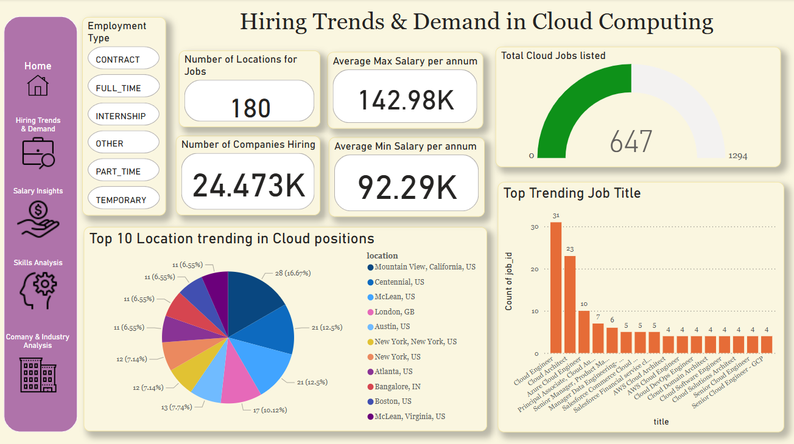
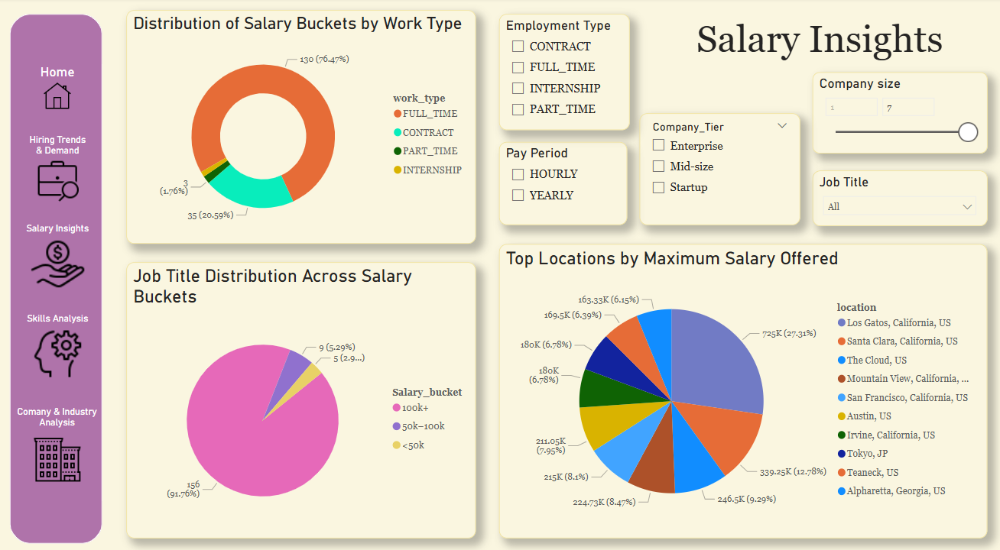
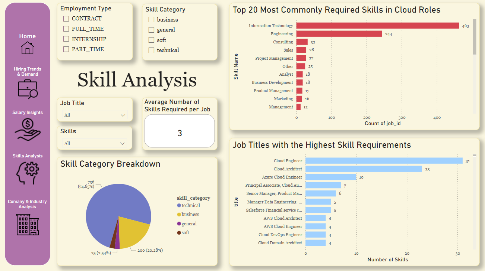
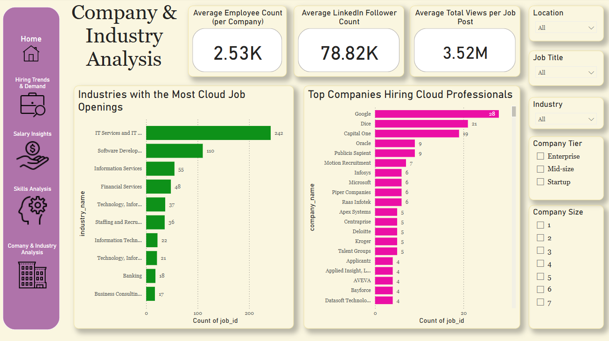

# 🌩 Cloud Career Insights Dashboard

Empowering Careers in the Evolving World of Cloud Computing  
**Team 17**: Krishna Chaitanya Reddy Kallam, Sai Kandi, Josh Rajesh Reddy Katakam, Jasmithi Karri, Nishanth Kannepogu, Mahender Reddy Kamidi

---

## 📌 Project Overview

The **Cloud Career Insights Dashboard** is a Power BI-driven application designed to inform and empower job seekers, HR managers, recruiters, and educators about the latest **trends in cloud computing roles**. By integrating datasets on job postings, salaries, skills, industries, and companies, our dashboard offers a **360-degree view of the cloud job market**.

---

## 🎯 Project Objectives

- Identify **trending cloud roles** and hiring locations  
- Analyze **skill demands** and **training needs**  
- Benchmark **salary distributions** by job type and region  
- Provide insights into **company and industry dynamics**

---

## 🧑‍💻 Intended Users

- **Cloud Job Seekers** – to discover job hotspots and tailor their skills  
- **HR Managers/Recruiters** – to align talent acquisition and salary offers  
- **Educators & Upskilling Platforms** – to shape course offerings based on demand

---

## 📁 Final Data Files Used

1. `jobs.csv` – Includes job titles, city, state, and employment type  
2. `salaries.csv` – Cleaned and normalized salary ranges  
3. `skills.csv` + `job_skills.csv` – Merged to form skill-job mappings  
4. `companies_cleaned.csv` – Company size and follower data  
5. `industries_cleaned.csv` – Industry information linked to job IDs  
6. `employees_count_cleaned.csv` – Company size and categorization  
7. `StateMapping.xlsx` – Standardized state names and codes  
8. `company_industries.csv` & `job_industries.csv` – Used for industry mapping

---

## 🔧 Data Preparation & Transformation

All transformations are documented in [`data_transformation_log.xlsx`](./data_transformation_log.xlsx). 
Key tasks included:

- **Joining datasets** using `job_id` and `company_id`
- Creating derived columns:
  - `Salary Bucket`: `<50k`, `50k-100k`, `100k+`
  - `Work Type` and `Employment Type` normalization
  - `Unified Location` field combining `City, State, Country`
  - `Skill Categories`: Technical, Business, General, Soft
- Salary normalization from **hourly to annual**
- Handling missing values and outliers
- Mapped U.S. states to full names using `StateMapping.xlsx`

---

## ⚙️ How We Processed the Data
1. Mapped raw job data with salary and skills
2. Normalized salary using formula logic
3. Grouped skills into categories
4. Validated datasets with sampling and summary stats

---

## 📊 Dashboard Features (Power BI)

### 1. **Hiring Trends & Demand**
- KPIs: Number of companies hiring, job locations, average min/max salaries
- Visuals: Bar chart (trending roles), pie chart (top locations), gauge (cloud job density)
- Filters: Employment type

### 2. **Salary Insights**
- Distribution by job type and location
- Salary buckets across job titles
- Company tier and size breakdowns

### 3. **Skill Analysis**
- Most in-demand skills and role-skill requirements
- Skill category (technical, business, general, soft)
- Average skills per job metric

### 4. **Company & Industry Analysis**
- Top hiring companies and most active industries
- Average company size, LinkedIn followers, job views
- Insights into enterprise vs. startup hiring trends

---

## 🧠 Technical Tools Used

- **Power BI**: Dashboard creation, slicers, dynamic visuals  
- **Excel**: Data cleaning, join operations, validation  
- **Power Query**: ETL transformations  
- **DAX**: KPIs, custom measures (e.g., average salaries, counts)

---

## 👥 Team Roles & Contributions

| **Member** | **Role** | **Key Responsibilities** |
|------------|----------|---------------------------|
| **Krishna Chaitanya Reddy Kallam** | Project Lead & Data Scientist | EDA, KPIs, risk planning, Trello board management, final validation |
| **Sai Kandi** | Data Scientist | Cleaned salary data, created DAX measures, led job & skill trend analytics |
| **Josh Rajesh Reddy Katakam** | IT Architect | Power Query joins, schema alignment, created unified location columns |
| **Jasmithi Karri** | Dashboard Developer | Designed all visuals, created navigation UI, filters, slicers |
| **Nishanth Kannepogu** | Data Analyst | Conducted exploratory analysis, created hiring/salary visuals |
| **Mahender Reddy Kamidi** | Business Analyst | Collected requirements, built traceability matrix, validated usability |

---

## 📽 Presentations

### 🎤 [Technical Presentation (PPT)](Technical - Cloud Career Insights Dashboard.pptx)  
Covers user context, transformation strategy, data logic, and visual explanations.

### 🎤 [Reflection Presentation (PPT)](Reflection - Cloud Career Insights Dashboard.pptx)  
Includes learning reflections, team coordination efforts, and future applications.

### 📹 Final Video Demo   
A guided 10-minute walkthrough of the full dashboard (embed link once uploaded).

---

## 📈 Traceability & Validation

- Project requirements mapped using [`Team17_Traceability_Matrix.xlsx`](./Team17_Traceability_Matrix.xlsx)
- Validated through:
  - Sampling and spot-checks
  - Cross-validation between datasets
  - Filter logic testing in Power BI

---

## ✅ Final Submission Checklist

| Item | Status |
|------|--------|
| Cleaned Data Files | ✅ Included in the library |
| Data Transformation Workbook | ✅ `data_transformation_log.xlsx` |
| Traceability Matrix | ✅ `Team17_Traceability_Matrix.xlsx` |
| Power BI Dashboard | ✅ Embedded `.pbix` or via screenshots |
| Presentations | ✅ Linked above |
| Video | ✅ Included in the library  |

---

## 💡 Instructions to View
1. Open `dashboard.pbix` using Power BI Desktop.
2. Use the slicers to filter by location, company, and job title.
3. View Hiring Trends, Skill Demand, Salary Insights, and Company Profiles.

---

## 🙌 Acknowledgements

- **Faculty**: Prof. Maria Weber  
- **Course**: IS-5960-04 – Master’s Research Project  
- **Tools**: Power BI, Excel, DAX, Power Query  
- **Data Sources**: Kaggle, LinkedIn sample exports

---

> Built by **Team 17** – Discover where opportunity meets innovation in cloud careers.
